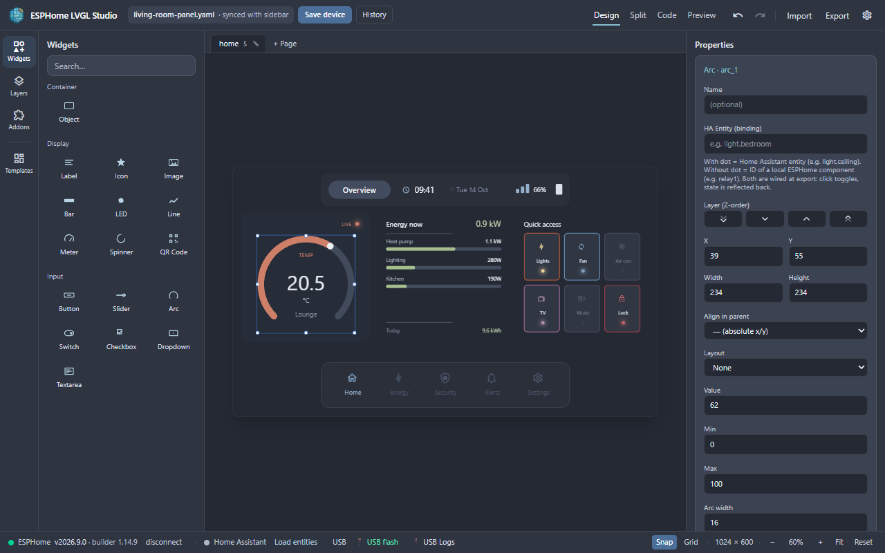
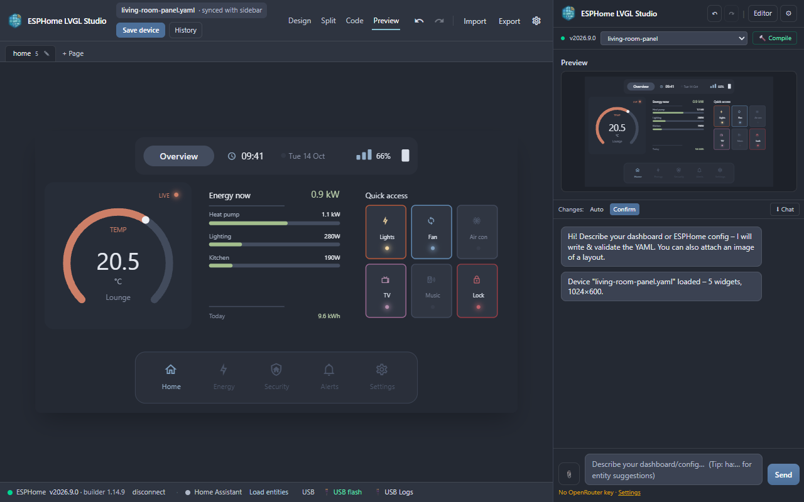

# ESPHome LVGL Studio

<p align="center">
  
</p>

<p align="center">
  <b>Visual LVGL Dashboard Builder & Autonomous AI Coding Assistant for ESPHome</b>
</p>

<p align="center">
  <a href="#key-features">Key Features</a> •
  <a href="#installation--store">Installation</a> •
  <a href="#quick-start-guide">Quick Start</a> •
  <a href="#addon-ecosystem">Addon Ecosystem</a> •
  <a href="#development">Development</a> •
  <a href="AI_README.md">AI & Architecture Reference</a>
</p>

---

**ESPHome LVGL Studio** is a modern browser extension (Firefox & Chrome) designed to visually design, build, and deploy stunning **LVGL (Light and Versatile Graphics Library)** display dashboards for ESPHome devices.

Equipped with an optional **AI Agent** (any model available on OpenRouter, with your own API key), ESPHome LVGL Studio allows you to generate complete dashboards from scratch, convert design sketches into code, compile firmware directly from your browser, and auto-fix compilation errors in a self-correction loop.

<p align="center">
  
</p>
<p align="center">
  
</p>

---

## 🌟 Key Features

### 🎨 Visual Drag-and-Drop LVGL Editor
- **Rich Widget Library**: Buttons, Sliders, Arcs, Switches, Checkboxes, Dropdowns, LEDs, Lines, Images, Meters, Spinners, Textareas, QR Codes, and Containers.
- **Flexible Canvas & Alignment**: Precision positioning with pixel offsets or robust LVGL alignment anchors (`top_left`, `center`, `bottom_right`, etc.).
- **Flexbox & Grid Layouts**: Native support for LVGL Flex and Grid container layouts with configurable gaps, flex-grow, and cell spans.
- **Multiple Display Screens**: Manage multi-page display interfaces (`lvgl: pages:`) with custom screen transitions and page action triggers.
- **39 Widget Templates**: Ready-made cards (climate, lighting, energy, security, scenes, Wi-Fi setup …) in four colour themes, labelled in your language.
- **Three Interface Themes**: Nord Frost, Graphite & Amber and Forest & Teal – switch under *Settings → Appearance*.

### 🤖 Autonomous AI Coding Agent (OpenRouter)
- **Natural Language Dashboard Builder**: Describe the interface you want or ask the AI to tweak colors, layouts, and typography.
- **Vision AI Support**: Upload screenshots, wireframe sketches, or UI designs—the AI reads the layout and translates it into valid ESPHome LVGL YAML.
- **Auto-Debug & Self-Correction Loop**: When compilation fails, the AI analyzes the build log, identifies the root cause, modifies the YAML, and re-validates (up to a few attempts).
- **You stay in control**: By default every AI change is shown as a diff to confirm; switch to *Auto* if you prefer.

### 🔒 Structure-Preserving CST YAML Engine
- **Preserves Your Existing Code**: Edits made in the visual editor use a CST (Concrete Syntax Tree) parser that preserves your existing Home Assistant entity bindings, lambdas, custom components, Wi-Fi settings, and code comments.

### 📡 Direct ESPHome & Home Assistant Integration
- **Live Device Syncing**: Connect directly to your ESPHome dashboard to load, edit, and save YAML configurations.
- **Wireless (OTA) & USB Flashing**: Compile and flash firmware over Wi-Fi (OTA) or per USB directly within your browser.
- **Live Log Streamer**: Read serial logs and boot traces directly from USB, with a 1-click button to hand off logs to the AI for debugging.
- **Home Assistant Autocomplete**: Instant entity autocompletion (`ha:light...`) and automated binding creation (`<widget_id>__state`).

### 🧩 Declarative JSON Addon System
- **Pure JSON Addons**: Extend the editor with custom widgets, dynamic cards, and complex integrations without writing code.
- **Ready-made Addons**: [Weather radar map](docs/examples/weather-radar) (map point, animated DWD rain radar, clock) and [Frigate camera](docs/examples/frigate-camera) (camera picker, overlays), plus small starter manifests in [docs/examples](docs/examples).
- **Easy Install**: Nothing is pre-installed – in *Settings → Addons* choose *From URL* and paste e.g. `https://raw.githubusercontent.com/bejak1999/esphome-lvgl-studio/main/docs/examples/weather-radar/addon.json`, or load a file / paste JSON.
- **Custom Addon Creator**: Create your own manifests with custom settings, live image previews, and generated YAML templates. See [docs/ADDONS.md](docs/ADDONS.md).

### 🌍 Fully Internationalized (English & German)
- **Bilingual Interface & Agent**: Built-in i18n system with full UI translations for English and German, defaulting to English. The AI agent automatically matches your selected UI language.

---

## 🚀 Installation & Store Setup

### Browser stores

| Browser | Store | Status |
| --- | --- | --- |
| Firefox (≥ 140) | Firefox Add-ons (AMO) | coming soon |
| Chrome / Edge / Brave | Chrome Web Store | coming soon |

Until the store listings are live, use the manual installation below.

### Manual installation (from GitHub Releases)
1. Download the latest `…-firefox.zip` or `…-chrome.zip` from the [GitHub Releases](https://github.com/bejak1999/esphome-lvgl-studio/releases) page.
2. **Firefox**:
   - Open `about:debugging#/runtime/this-firefox` in your URL bar.
   - Click **Load Temporary Add-on...** and select the downloaded `.zip` (or `manifest.json` inside the unzipped folder).
   - Temporary add-ons are removed when Firefox restarts – use the store version for permanent installation.
3. **Chrome / Edge / Brave**:
   - Unzip the `…-chrome.zip`.
   - Open `chrome://extensions`, enable **Developer mode** (top right toggle).
   - Click **Load unpacked** and select the unzipped folder.

> **Permissions:** the extension does not ask for access to “all websites”. Access to your ESPHome dashboard,
> Home Assistant and other devices is requested per host when you save the settings or click *connect* –
> your browser shows a short prompt once per host.
>
> **How the ESPHome connection works:** the ESPHome device builder rejects WebSocket connections from foreign origins (HTTP 403).
> Firefox rewrites the `Origin` header of that one handshake (`webRequest`). Chrome cannot do that for WebSockets, so the
> Chrome version opens the socket from a hidden frame on your ESPHome host instead (`scripting` permission). Both only ever
> touch the ESPHome URL you configured in the settings.

---

## 💡 Quick Start Guide

### 1. Configure Connection Settings
- Click the **⚙ Settings** icon in the sidebar or editor toolbar.
- Enter your **ESPHome Dashboard URL** (e.g. `http://192.168.1.10:6052`).
- *(Optional)* Enter your **Home Assistant Access Token** for live entity autocompletion.
- *(Optional)* Enter your **OpenRouter API Key** and choose an AI model from the list.
- Select your preferred **Language** (English or German).

### 2. Connect & Edit
- Click **Connect** in the toolbar to fetch your ESPHome devices.
- Select your device from the dropdown menu to load its active YAML configuration into the editor.

### 3. Build & Design
- **Visual Design**: Drag widgets from the left palette onto the canvas. Adjust colors, fonts, border radii, shadows, gradients, and flexbox/grid properties in the right panel.
- **AI-Assisted Design**: In the sidebar chat, describe what you want (e.g., *"Add a dark-themed thermostat card with temperature slider and MDI icons"*).
- **Image Import**: Drag and drop a UI mockup or sketch into the chat—the AI will construct the matching LVGL layout.

### 4. Compile & Deploy
- Click **🔨 Compile** in the sidebar.
- If any compilation errors occur, the **AI Agent** automatically intercepts the error log, fixes the code, and re-validates.
- Click **📡 Flash via Wi-Fi** in the sidebar or **USB flash** in the editor's status bar (USB needs Chrome/Edge – Firefox has no Web Serial) to upload the firmware to your display.

---

## 🧩 Addon Ecosystem

ESPHome LVGL Studio features a completely declarative **JSON Addon Engine**. Addons are written purely in JSON and contain no executable JavaScript. Addons that bring ESPHome `!lambda` code show a warning with the code before they are installed.

```json
{
  "id": "com.example.hello",
  "name": "Hello Label",
  "version": "1.0.0",
  "icon": "👋",
  "fields": [
    { "key": "text", "kind": "text", "label": "Text", "default": "Hello" },
    { "key": "color", "kind": "color", "label": "Colour", "default": "#e5e7eb" }
  ],
  "widgets": [
    { "key": "label", "type": "label", "props": { "text": "{{ config.text }}", "text_color": "{{ config.color }}" } }
  ]
}
```

Learn how to use included templates or create your own custom addons in the [Addons Documentation](docs/ADDONS.md).

---

## 💻 Development & Building from Source

### Prerequisites
- Node.js (v18+ recommended)
- npm

### Setup
```bash
# Clone repository
git clone https://github.com/bejak1999/esphome-lvgl-studio.git
cd esphome-lvgl-studio

# Install dependencies and prepare WXT framework
npm install
```

### Reproducible build (store review)
The store packages are built from the sources ZIP with exactly these steps (Node.js 22, npm 10):
```bash
npm ci
npm run zip          # → .output/esphome-lvgl-studio-<version>-firefox.zip
npm run zip:chrome   # → .output/esphome-lvgl-studio-<version>-chrome.zip
```
The output is byte-identical to the submitted package.

### Tests
```bash
npm run check        # typecheck, ESLint, unit tests
npm run build && npm run build:chrome
node tests/e2e/permissions.mjs   # production build: behaviour without host permission
E2E_HOSTS=1 npm run build && E2E_HOSTS=1 npm run build:chrome
npm run test:e2e     # Chrome + Firefox against a simulated ESPHome device builder (test build)
```

### Build Commands
```bash
# Start Firefox extension with Hot-Module Replacement (HMR)
npm run dev

# Start Chrome extension with HMR
npm run dev:chrome

# Production Build for Firefox
npm run build

# Production Build for Chrome
npm run build:chrome

# Package extensions for the stores (.zip)
npm run zip          # Firefox (+ sources zip for AMO review)
npm run zip:chrome   # Chrome

# Typecheck & Run Unit Tests
npm run compile
npm run test
```

---

## 📄 License & Credits

- Licensed under the [GNU General Public License v3.0](LICENSE). Bundled third-party components and their licenses: [THIRD_PARTY_NOTICES.txt](src/public/THIRD_PARTY_NOTICES.txt).
- Built with [Vue 3](https://vuejs.org/), [Vite](https://vitejs.dev/), [WXT Extension Framework](https://wxt.dev/), and [Tailwind CSS v4](https://tailwindcss.com/).
- Material Design Icons provided by [@mdi/font](https://materialdesignicons.com/).
- ESPHome and LVGL are trademarks of their respective open-source communities.

---

<p align="center">
  For AI Agents and Architecture Documentation, see <a href="AI_README.md">AI_README.md</a>.
</p>
